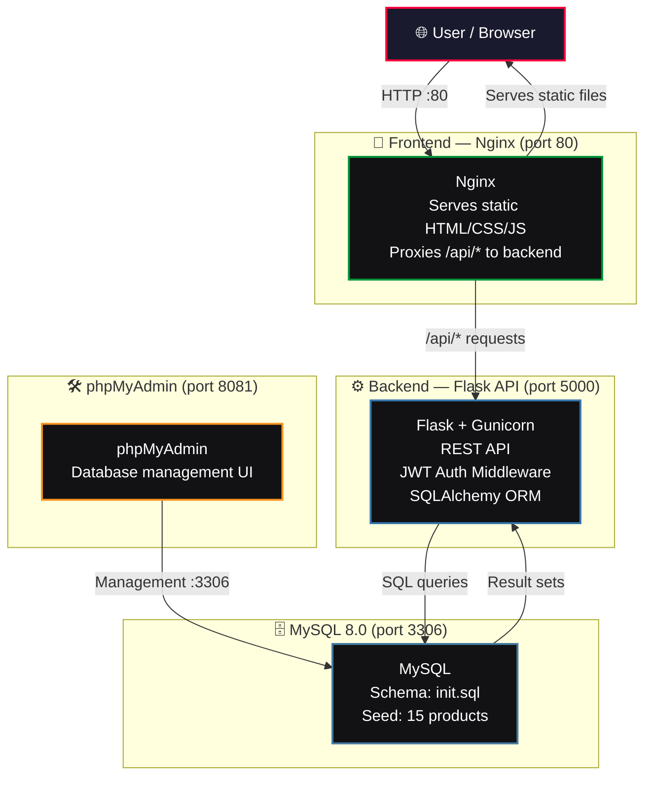

<p align="center">
  
  
  
  
  
  
  
</p>

<h1 align="center">⚔️ BUSHIDO BRAND ⚔️</h1>
<p align="center">
  <em>Urban streetwear meets Japanese warrior ethos — a full-stack e-commerce platform</em>
</p>

---

## 🚀 Overview

**Bushido Brand** is a full-stack e-commerce web application for a fictional streetwear brand inspired by the samurai code ("Bushido"). It features a dark, neon-accented Neo-Tokyo aesthetic and is built as a 3-tier architecture with a vanilla JavaScript frontend served by Nginx, a Flask REST API backend, and a MySQL 8.0 database.

| Tier | Tech | Role |
|------|------|------|
| 🎨 **Frontend** | HTML5, CSS3, Vanilla JavaScript, GSAP | Static storefront with animations & interactivity |
| ⚙️ **Backend** | Python 3.11, Flask 3.0, SQLAlchemy, JWT | REST API for products, auth, cart, orders, contact |
| 🗄️ **Database** | MySQL 8.0 | Persistent product, user, order, and cart data |

---

## 🏗️ Architecture



**Request flow:**
1. Browser loads static HTML/CSS/JS from Nginx on port 80
2. JavaScript makes API calls to `/api/*` — Nginx proxies these to the Flask backend
3. Flask processes requests, queries MySQL via SQLAlchemy, returns JSON responses
4. Frontend renders data dynamically into the DOM

---

## ✨ Features

### 🛍️ Storefront ("The Armory")
- **Product catalog** with category filtering (T-Shirts, Hoodies, Accessories)
- **Product detail pages** with dynamic content loaded by ID
- **Interactive shopping cart** — a slide-out sidebar with real-time badge count
- **Full-page cart** with quantity management and total calculation
- **User authentication** — register and login with JWT-based sessions
- **Checkout flow** requiring authenticated session with order summary
- **Contact form** with backend submission

### 🎬 Animations & UX
- **GSAP-powered hero reveal** — text and logo animate on page load
- **Parallax scrolling** effect on the landing page
- **Staggered product card** entrance animations via ScrollTrigger
- **Glass-morphism navbar** that sticks on scroll
- **Smooth transitions** on hover states, cart slide-in, and page elements
- **Responsive design** — adapts to mobile, tablet, and desktop

### 🔐 Security
- **JWT authentication** — tokens expire after 24 hours
- **Password hashing** via Flask-Bcrypt
- **CORS middleware** — API access controlled per origin
- **Input validation** — email format, password strength, required fields
- **SQLAlchemy ORM** — parameterized queries prevent SQL injection

---

## 📦 Tech Stack

| Category | Technologies |
|----------|--------------|
| **Frontend** | HTML5, CSS3 (Grid/Flexbox/Custom Properties), Vanilla JavaScript, GSAP (ScrollTrigger) |
| **Backend** | Python 3.11, Flask 3.0.2, Gunicorn 26.0, SQLAlchemy 3.1.1, PyJWT 2.13, Flask-Bcrypt |
| **Database** | MySQL 8.0 |
| **Infrastructure** | Docker, Docker Compose, Nginx (Alpine), phpMyAdmin |

### Frontend Dependencies
All client-side, loaded via CDN:
- **GSAP** — GreenSock Animation Platform for high-performance animations
- **Google Fonts** — Syncopate (display) + Inter (body)

### Backend Dependencies
```text
Flask==3.0.2
Flask-SQLAlchemy==3.1.1    # ORM
Flask-Cors==6.0.5          # Cross-Origin Resource Sharing
PyMySQL==1.2.0             # MySQL driver
PyJWT==2.13.0              # JSON Web Token auth
Flask-Bcrypt==1.0.1        # Password hashing
python-dotenv==1.0.1       # Environment variable loading
gunicorn==26.0.0           # Production WSGI server
email-validator==2.1.0     # Email format validation
cryptography==49.0.0       # Cryptographic utilities
```

---

## 🧱 Project Structure

```
bushido-brand/
├── frontend/                     # 🎨 Nginx-served static site
│   ├── Dockerfile
│   ├── nginx.conf                # Static file serving + API proxy config
│   └── src/
│       ├── css/
│       │   ├── main.css          # Design tokens, variables, base styles
│       │   ├── navbar.css        # Glass-morphism fixed navigation
│       │   ├── hero.css          # Full-viewport hero section
│       │   ├── products.css      # Product grid & filter layout
│       │   ├── cart.css          # Slide-out sidebar & full-page cart
│       │   └── responsive.css    # Mobile/tablet breakpoints
│       ├── js/
│       │   ├── main.js           # Component loader, page initialization
│       │   ├── api.js            # HTTP client (GET/POST/DELETE) with auth
│       │   ├── products.js       # Product fetching, filtering, card rendering
│       │   ├── cart.js           # localStorage cart state, add/remove/badge
│       │   ├── checkout.js       # Order submission with auth check
│       │   └── animations.js     # GSAP hero reveal, parallax, scroll triggers
│       ├── components/
│       │   ├── navbar.html       # Reusable nav bar
│       │   ├── hero.html         # Reusable hero section
│       │   ├── footer.html       # Reusable footer
│       │   └── product-card.html # Reusable product card template
│       └── pages/
│           ├── index.html        # Landing page — hero, featured products, cart
│           ├── products.html     # "The Armory" — full catalog with filters
│           ├── product-detail.html # Single product view (?id=)
│           ├── cart.html         # Full-page cart management
│           ├── checkout.html     # "Deployment Center" — order placement
│           ├── about.html        # "The Ronin Code" — brand story
│           └── contact.html      # "Send a Signal" — contact form
│
├── backend/                      # ⚙️ Flask REST API
│   ├── Dockerfile
│   ├── requirements.txt
│   ├── entrypoint.sh             # Container startup: wait for DB, then gunicorn
│   ├── app.py                    # Flask application factory
│   ├── config.py                 # Configuration (DB URL, JWT, secrets)
│   └── src/
│       ├── middleware/
│       │   ├── auth.py           # JWT token verification decorator
│       │   └── cors.py           # CORS policy initialization
│       ├── models/
│       │   ├── product.py        # Product model (id, name, price, category, etc.)
│       │   ├── user.py           # User model (id, email, password hash, etc.)
│       │   ├── cart.py           # Cart model (user_id, product_id, quantity)
│       │   └── order.py          # Order model (user_id, items, total, status)
│       ├── routes/
│       │   ├── products.py       # GET /api/products (list, filter by category)
│       │   ├── auth.py           # POST /api/auth/register, /api/auth/login
│       │   ├── cart.py           # GET/POST/DELETE /api/cart (item management)
│       │   ├── orders.py         # POST /api/orders (checkout), GET (history)
│       │   └── contact.py        # POST /api/contact (submit inquiries)
│       └── utils/
│           ├── helpers.py        # Shared utility functions
│           └── validators.py     # Input validation (email, password, fields)
│
├── db/                           # 🗄️ Database
│   ├── init.sql                  # Schema: tables, indexes, constraints
│   └── seed.sql                  # Seed data: 15 starter products
│
├── docker-compose.yml            # 🐳 Local development orchestration
└── .env                          # Environment variables (secrets, config)
```

---

## 🚦 Getting Started

### Prerequisites
- [Docker](https://docs.docker.com/get-docker/) & [Docker Compose](https://docs.docker.com/compose/install/)
- Git

### Local Development

```bash
# 1. Clone the repository
git clone https://github.com/HamzaMaLik121/bushido-brand-app-.git
cd bushido-brand-app-

# 2. Create environment configuration
cp .env.example .env
# Edit .env to customize your secrets

> **Required environment variables** (pre-configured with safe defaults in `.env.example`):
> | Variable | Purpose |
> |----------|---------|
> | `MYSQL_ROOT_PASSWORD` | MySQL root password |
> | `MYSQL_DATABASE` | MySQL database name |
> | `SECRET_KEY` | Flask application secret key |
> | `JWT_SECRET_KEY` | JWT token signing secret |

# 3. Start all services
docker-compose up --build
```

### Services

| Service | URL | Description |
|---------|-----|-------------|
| 🌐 **Website** | http://localhost | Bushido Brand storefront |
| 🗄️ **phpMyAdmin** | http://localhost:8081 | Database management (user: `root`, password from `.env`) |
| ⚙️ **API** | http://localhost/api/ | Flask REST API (proxied through Nginx) |
| ❤️ **Health** | http://localhost/api/health | API health check endpoint |

To stop:
```bash
docker-compose down
```

To stop and reset all data:
```bash
docker-compose down -v
```

---

## 🧩 Frontend Pages

| Page | File | Description |
|------|------|-------------|
| **Home** | `index.html` | Landing page with parallax hero, featured products grid, slide-out cart |
| **Products** | `products.html` | "The Armory" — full catalog with category filter buttons + grid |
| **Product Detail** | `product-detail.html` | Single product view loaded dynamically by `?id=` parameter |
| **Cart** | `cart.html` | Full cart page with quantity controls and total |
| **Checkout** | `checkout.html` | "Deployment Center" — address form + order manifest |
| **About** | `about.html` | "The Ronin Code" — brand philosophy and story |
| **Contact** | `contact.html` | "Send a Signal" — inquiry form that POSTs to the API |

### Client-Side State
- **Cart** is stored in `localStorage` under the key `bushido_cart`
- **Auth token** is stored in `localStorage` as `bushido_token`
- **User info** is stored in `localStorage` as `bushido_user`
- The cart badge in the navbar updates in real-time via `cart.js`

---

## 📡 API Reference

All API endpoints are prefixed with `/api` and proxied through Nginx.

### Health

```
GET /api/health
→ 200 { "status": "healthy" }
```

### Authentication

```
POST /api/auth/register
Body: { "email": "...", "password": "...", "name": "..." }
→ 201 { "message": "User registered successfully", "token": "jwt...", "user": {...} }

POST /api/auth/login
Body: { "email": "...", "password": "..." }
→ 200 { "message": "Login successful", "token": "jwt...", "user": {...} }
```

### Products

```
GET /api/products
Query: ?category=T-Shirts (optional filter)
→ 200 { "products": [...] }

GET /api/products/<id>
→ 200 { "product": {...} }
```

### Cart (requires JWT token in `Authorization: Bearer <token>` header)

```
GET /api/cart
→ 200 { "cart_items": [...] }

POST /api/cart
Body: { "product_id": 1, "quantity": 2 }
→ 201 { "message": "Item added to cart" }

DELETE /api/cart/<item_id>
→ 200 { "message": "Item removed from cart" }
```

### Orders (requires JWT token)

```
POST /api/orders
Body: { "address": "...", "city": "...", "zip_code": "...", "items": [...] }
→ 201 { "message": "Order placed successfully", "order_id": 1 }

GET /api/orders
→ 200 { "orders": [...] }
```

### Contact

```
POST /api/contact
Body: { "name": "...", "email": "...", "message": "..." }
→ 201 { "message": "Message sent successfully" }
```

---

## 🗄️ Database Schema

### Tables

#### `users`
| Column | Type | Description |
|--------|------|-------------|
| `id` | INT (PK, AUTO_INCREMENT) | Unique user ID |
| `name` | VARCHAR(100) | Display name |
| `email` | VARCHAR(120) (UNIQUE) | Login email |
| `password` | VARCHAR(255) | Bcrypt-hashed password |
| `created_at` | TIMESTAMP | Account creation date |

#### `products`
| Column | Type | Description |
|--------|------|-------------|
| `id` | INT (PK, AUTO_INCREMENT) | Unique product ID |
| `name` | VARCHAR(200) | Product name |
| `description` | TEXT | Detailed description |
| `price` | NUMERIC(10,2) | Price in USD |
| `category` | VARCHAR(100) | Category (T-Shirts, Hoodies, Accessories) |
| `image_url` | VARCHAR(500) | Product image path |
| `sizes` | JSON | Available sizes array |
| `stock` | INT | Inventory count |
| `created_at` | TIMESTAMP | Date added |

#### `cart_items`
| Column | Type | Description |
|--------|------|-------------|
| `id` | INT (PK, AUTO_INCREMENT) | Unique item ID |
| `user_id` | INT (FK → users.id) | Cart owner |
| `product_id` | INT (FK → products.id) | Product reference |
| `quantity` | INT | Number of units |
| `created_at` | TIMESTAMP | Date added to cart |

#### `orders`
| Column | Type | Description |
|--------|------|-------------|
| `id` | INT (PK, AUTO_INCREMENT) | Unique order ID |
| `user_id` | INT (FK → users.id) | Customer |
| `total_amount` | NUMERIC(10,2) | Order total |
| `status` | VARCHAR(50) | Order status (pending, shipped, delivered, cancelled) |
| `shipping_address` | TEXT | Delivery address |
| `city` | VARCHAR(100) | Shipping city |
| `zip_code` | VARCHAR(20) | Postal code |
| `created_at` | TIMESTAMP | Order date |

#### `order_items`
| Column | Type | Description |
|--------|------|-------------|
| `id` | INT (PK, AUTO_INCREMENT) | Unique line item ID |
| `order_id` | INT (FK → orders.id) | Parent order |
| `product_id` | INT (FK → products.id) | Product reference |
| `quantity` | INT | Units ordered |
| `price` | NUMERIC(10,2) | Price at time of purchase |

### Seed Data
The database includes **15 starter products** across 3 categories:

| Category | Products |
|----------|----------|
| **T-Shirts** | Shadow Ronin Tee, Code of the Samurai, Bushido Rising, The Way of the Warrior, Ghost of Tsushima |
| **Hoodies** | Night Stalker Hoodie, Ronin's Resolve, Shogun's Reign, The Dark Clan, Midnight Assassin |
| **Accessories** | Katana Steel Ring, Samurai's Honor Cap, Ronin's Wristband, Way of the Warrior Beanie, Bushido Blade Necklace |

---

## 🎨 Design System

The frontend uses a cohesive design system defined in `main.css`:

```css
:root {
  --primary: #ff003c;           /* Bushido red accent */
  --bg-primary: #0a0a0b;        /* Near-black background */
  --bg-secondary: #121213;      /* Card/section background */
  --bg-card: #1a1a1c;           /* Product card surface */
  --text-primary: #f5f5f5;      /* Main text */
  --text-secondary: #888;       /* Muted text */
  --border-color: #2a2a2d;      /* Subtle borders */
  --font-display: 'Syncopate', sans-serif; /* Headings */
  --font-body: 'Inter', sans-serif;         /* Body text */
  --transition: 0.3s cubic-bezier(0.4, 0, 0.2, 1);
}
```

- **Glass-morphism navbar** — translucent backdrop with blur
- **Red accent (#ff003c)** applied to buttons, links, hover states, and the cart badge
- **GSAP animations** on hero text reveal, parallax scroll, and staggered product card entrances
- **Slide-out cart sidebar** with smooth CSS transitions
- **Responsive breakpoints** at 1024px (tablet) and 768px (mobile)

---

## 🧪 Design Decisions

- **No JavaScript framework** — Vanilla JS keeps the bundle small, leverages native browser APIs, and avoids framework churn for a relatively simple storefront
- **localStorage for cart** — persists across sessions without requiring authentication until checkout
- **JWT over sessions** — stateless auth suitable for API consumption, no server-side session store needed
- **Nginx as reverse proxy** — serves static files efficiently, handles SSL termination (in production), and routes API calls to the Flask backend on a single port
- **SQLAlchemy ORM** — abstracts MySQL specifics, makes testing with SQLite possible, and provides migration-ready schema management
- **Docker Compose for dev** — single command to spin up the full stack with consistent environments across machines

---

<p align="center">
  Built with ❤️ using the <strong>Bushido Code</strong> — discipline, honor, and craftsmanship in every line.
</p>
<p align="center">
  <a href="https://github.com/HamzaMaLik121/bushido-brand-app-">
    
  </a>
</p>
